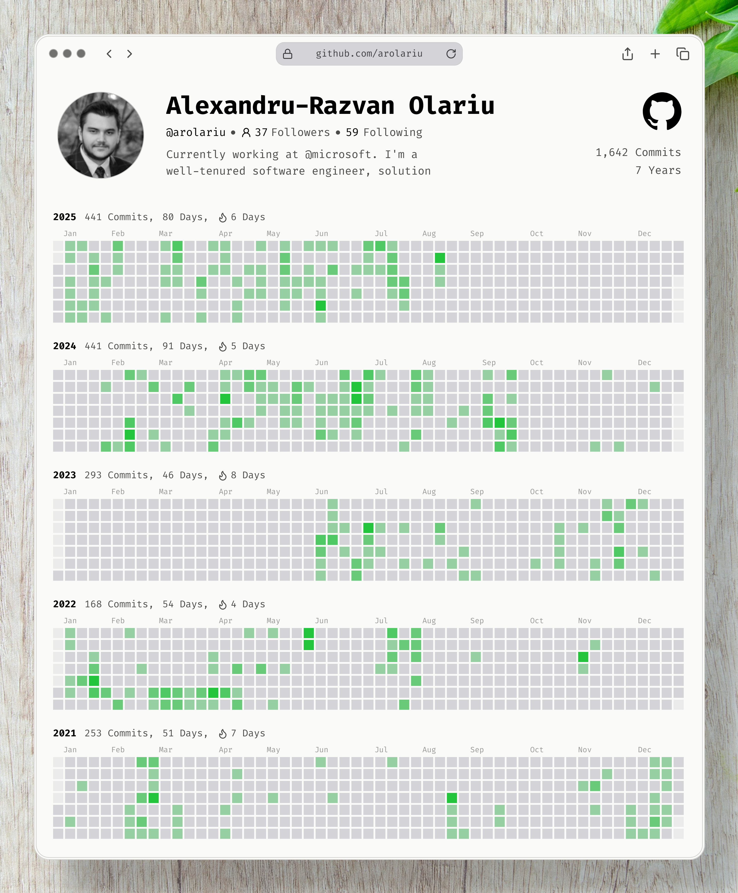

## Tech stack

Day‑to‑day tools I’m comfortable with:

## Recent activity

<!--RECENT_ACTIVITY:last_update-->
Last updated: Friday, August 15th, 2025, 11:21 PM
<!--RECENT_ACTIVITY:last_update_end-->

<!--RECENT_ACTIVITY:start-->
1. ⬆️ Pushed 1 commit(s) to [arolariu/arolariu](https://github.com/arolariu/arolariu) 
2. 📔 Created new repository [arolariu/arolariu](https://github.com/arolariu/arolariu) 
3. ⬆️ Pushed 4 commit(s) to [arolariu/arolariu.ro](https://github.com/arolariu/arolariu.ro) 
4. 🎉 Merged PR [#138](https://github.com/arolariu/arolariu.ro/pull/138) in [arolariu/arolariu.ro](https://github.com/arolariu/arolariu.ro) 
5. ⬆️ Pushed 4 commit(s) to [arolariu/arolariu.ro](https://github.com/arolariu/arolariu.ro) 
<!--RECENT_ACTIVITY:end-->

---

### Infographic

<small> Generated on 15th August, 2025</small>
