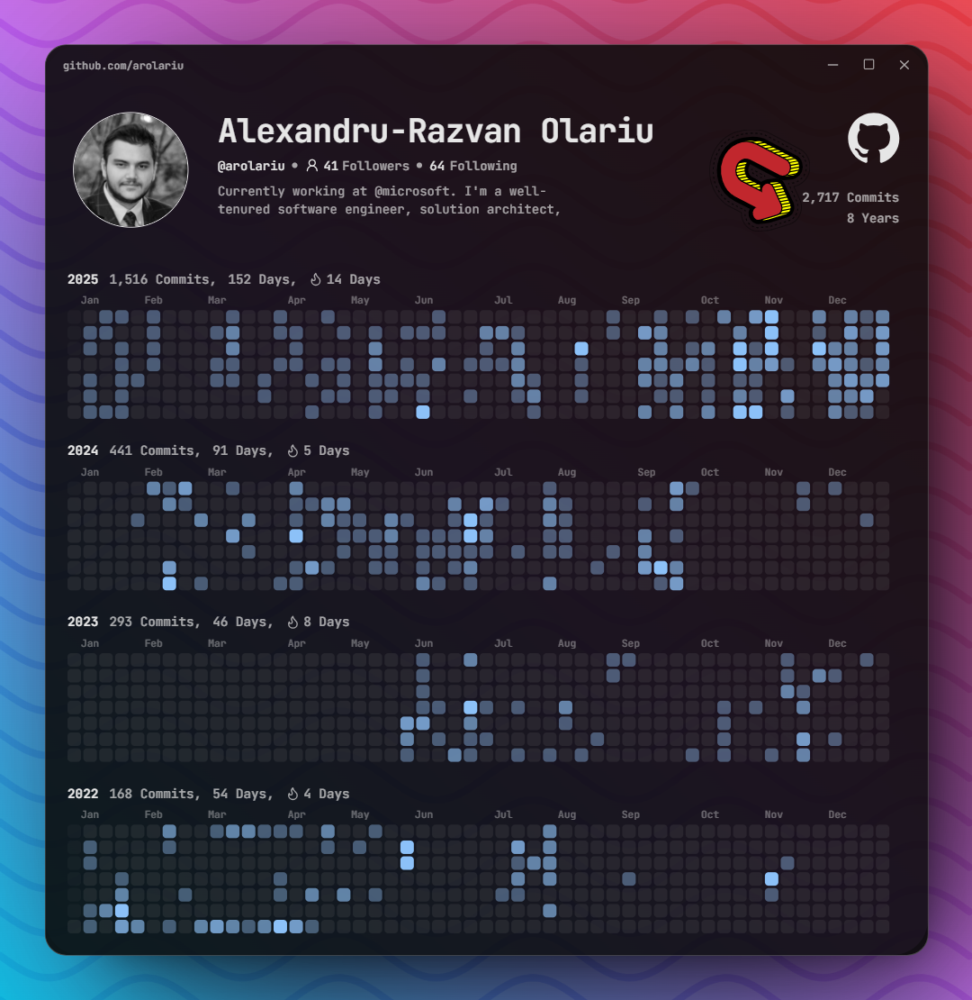

## Tech stack

Day‑to‑day tools I’m comfortable with:

## Recent activity

<!--RECENT_ACTIVITY:last_update-->
Last updated: Monday, December 1st, 2025, 3:53 AM
<!--RECENT_ACTIVITY:last_update_end-->

<!--RECENT_ACTIVITY:start-->
1. ⬆️ Pushed undefined commit(s) to [arolariu/arolariu.ro](https://github.com/arolariu/arolariu.ro) 
2. ⬆️ Pushed undefined commit(s) to [arolariu/arolariu.ro](https://github.com/arolariu/arolariu.ro) 
3. ⬆️ Pushed undefined commit(s) to [arolariu/arolariu.ro](https://github.com/arolariu/arolariu.ro) 
4. ⬆️ Pushed undefined commit(s) to [arolariu/arolariu.ro](https://github.com/arolariu/arolariu.ro) 
5. ⬆️ Pushed undefined commit(s) to [arolariu/arolariu.ro](https://github.com/arolariu/arolariu.ro) 
<!--RECENT_ACTIVITY:end-->

---

### Infographic

<small> Generated on 15th August, 2025</small>

